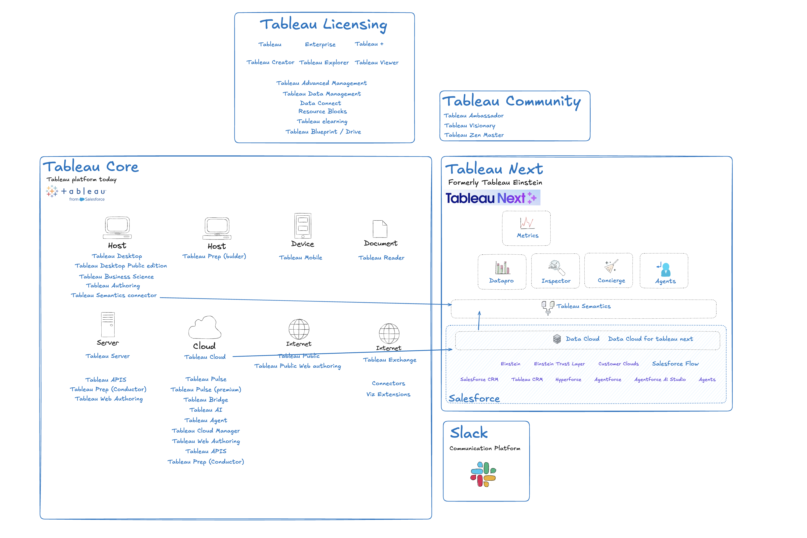

# Tableau Platform
A better platform diagram for Tableau Core and Tableau Next and anything from Salesforce that touches these two platforms.

## Diagram made using Escalidraw
https://excalidraw.com to find out how to use it. 

 - Link to view the diagram. https://link.excalidraw.com/l/8G59ugZXgZP/9fTZBGB39E0 
 - Presentation view: https://link.excalidraw.com/p/readonly/PuOayWt11E0Bp0Sd1rqT

## Missing Items 

- Tableau Partner
- Tableau Certification
- Tableau Forum
- Tableau Early Adopter
- Tableau Release Navigator
- File formats - hyper, twbx twb tds tdsx trex tfl tflx

## Product Categories

### Tableau Licensing
- **Core Licenses**
  - Tableau
  - Enterprise
  - Tableau +
- **User Roles**
  - Tableau Creator
  - Tableau Explorer
  - Tableau Viewer
- **Add-on & Learnings**
  - Tableau Advanced Management
  - Tableau Data Management
  - Data Connect
  - Resource Blocks
  - Tableau elearning
  - Tableau Blueprint / Drive

### Tableau Core (Current Platform)
- **Host: Desktop Applications**
  - Tableau Desktop
  - Tableau Desktop Public edition
  - Tableau Business Science
  - Tableau Authoring
  - Tableau Semantics connector
- **Host: Prep**
  - Tableau Prep (builder)
- **Server**
  - Tableau Server
  - Tableau APIs
  - Tableau Prep (Conductor)
  - Tableau Web Authoring
- **Cloud**
  - Tableau Cloud
  - Tableau Pulse
  - Tableau Pulse (premium)
  - Tableau Bridge
  - Tableau AI
  - Tableau Agent
  - Tableau Cloud Manager
  - Tableau Web Authoring
  - Tableau APIs
  - Tableau Prep (Conductor)
- **Sites**
  - Tableau Public
  - Tableau Public Web authoring
  - Tableau Exchange
  - Connectors
  - Viz Extensions
- **Device**
  - Tableau Mobile
- **Document readers**
  - Tableau Reader

### Tableau Next (Formerly Tableau Einstein)
- **Analytics Components**
  - Metrics
  - Datapro
  - Inspector
  - Concierge
  - Agents
- **Data Platform**
  - Tableau Semantics
  - Data Cloud
  - Data Cloud for Tableau next

### Salesforce Integration
- Einstein
- Einstein Trust Layer
- Customer Clouds
- Salesforce Flow
- Salesforce CRM
- Tableau CRM
- Hyperforce
- Agentforce
- Agentforce Ai Studio
- Agents

### Communication Platform
- Slack

### Tableau Community
- Tableau Ambassador
- Tableau Visionary
- Tableau Zen Master
